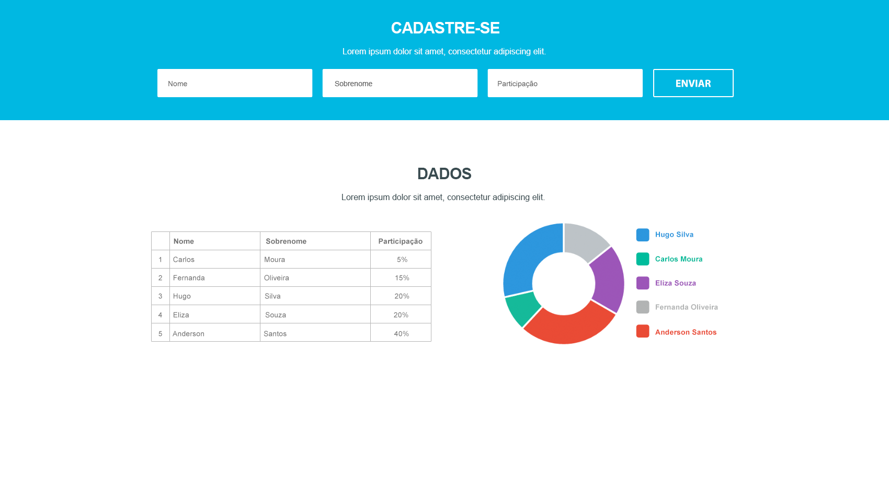

# Sugestão de desafio angular

Objetivo deste desafio é avaliarmos o seu domínio em desenvolvimento angular, ou seja, sua organização, estilo e boas práticas com o código, conhecimento dos frameworks e tecnologias utilizadas.

## O Desafio

Este é o layout que deverá ser produzido:


Aqui vai o layout em PSD:
[Download do arquivo](layout-onepage.psd)

---
#### Deixei pronto aqui neste repositório um projeto [base](https://github.com/alannsiqueira/ng-start) pra você não sair do zero. Mas sinta-se a vontade para alterar ou criar o seu próprio projeto ;)


### Algumas dicas e observações
> Obs 1.: Fique a vontade para utilizar qualquer 3rd party, deixei incluiso ao projeto a 3rd party do [PrimeNG](https://www.primefaces.org/primeng/#/).

> Obs 2.: Use Reactive Forms
 
> Obs 3.: Considere que todos os campos marcados com * como preenchimento obrigatório no formulário.

### install angular-cli
1. Para instalar o angular-cli você deve ter instalado antes o [Node.js](https://nodejs.org/) v8 ou superior junto com o NPM 5 ou superior.

2. Instalando o angular-cli 
    ```sh
    $ npm install -g @angular/cli
    ```

3. Faça clone deste repositório e suba o projeto

    Clone: 
    ```sh
    $ git clone https://github.com/alannsiqueira/sugestao-desafio-angular.git
    ```
    Instalando as dependências:
    ```sh
    $ npm install
    ```
    Iniciando o projeto:
    ```sh
    $ npm start
    ```
    Acesse http://localhost:9000/ para visualizar o projeto base

    Acesse http://localhost:3000/ para visualizar a API mockada
